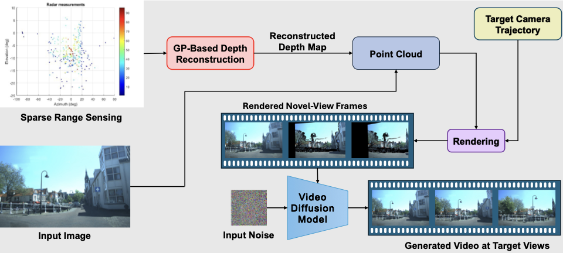
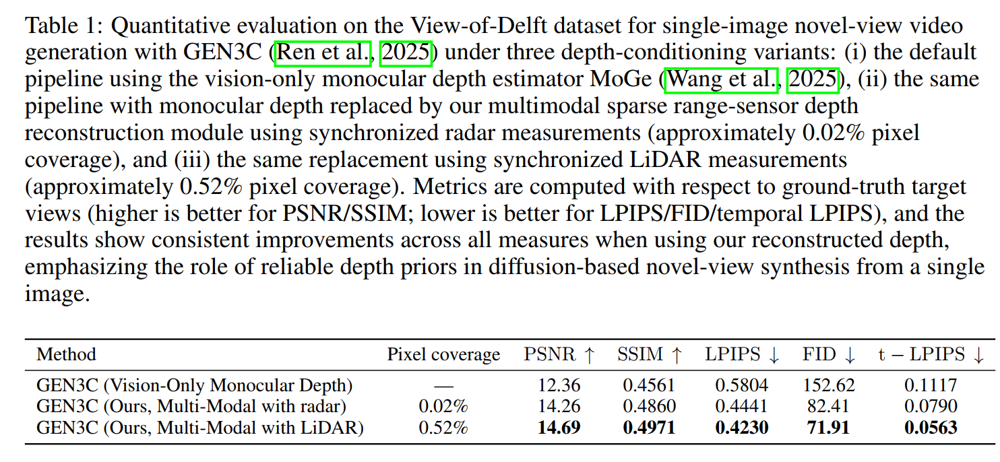
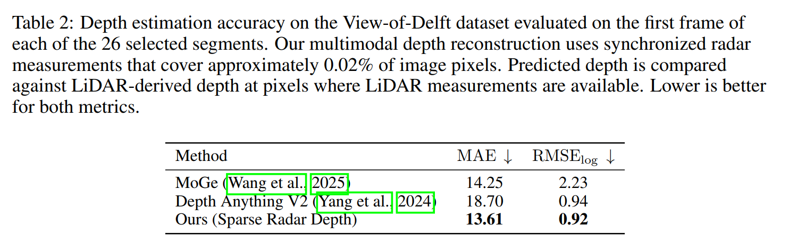
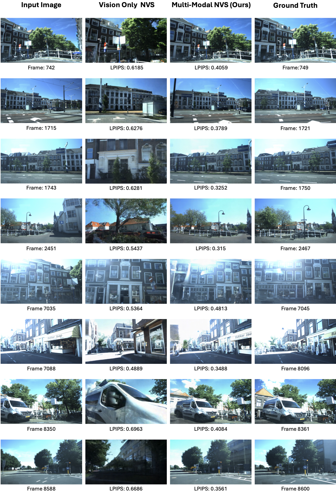

## MultiModalNVS: Official implementation of “A Single Image and Multimodality Is All You Need for Novel View Synthesis”

Published at **ICLR 2026 Workshop on Multimodal Intelligence Workshop**.

The method reconstructs dense depth from extremely sparse multimodal range measurements using localized Gaussian Processes, and plugs this depth into diffusion-based rendering pipelines for more robust and geometrically consistent novel-view synthesis.



## Quick installation with Pixi

### 1. Install Pixi

```bash
# Linux/macOS
curl -fsSL https://pixi.sh/install.sh | bash

# macOS with Homebrew
brew install pixi

# Windows (PowerShell)
iwr https://pixi.sh/install.ps1 -useb | iex

# After installation, restart your terminal or run:
source ~/.bashrc  # or source ~/.zshrc for zsh

pixi --version
```

### 2. Clone this repository

```bash
git clone --recurse-submodules https://github.com/importAmir/MultiModalNVS.git
cd MultiModalNVS
```

### 3. Create and activate the Pixi environment

```bash
pixi install
pixi shell
```

### 4. Install additional dependencies

```bash
pixi run install-all-deps
```

### 5. Import GEN3C and download checkpoints

You need a Hugging Face account and token to download GEN3C checkpoints. Get your token from [Hugging Face Settings](https://huggingface.co/settings/tokens) (Read permission).

```bash
pixi run import
pixi run download-gen3c-checkpoints -- <HF_TOKEN>
```

### 6. DepthAnythingV2 (optional)

```bash
pixi run import-dav2
pixi run download-dav2-checkpoints
```

### 7. Copy custom code into the GEN3C pipeline

This step synchronizes the local customization code in this repository into the `GEN3C` submodule so it is available to the GEN3C pipeline. Run this again whenever you modify the local customization scripts.

```bash
pixi run copy-custom
```

## Code overview

### Dense depth from sparse range (`predict_dense_depth.py`)

`predict_dense_depth.py` predicts dense camera-Z depth on a raster of size `H x W` from sparse 3D points.

```bash
pixi run predict-dense-depth -- \
  --points-bin /path/to/000750.bin \
  --calib-txt /path/to/000750.txt \
  --image-size 1248 1920
```

#### Input format (View of Delft example)

- **`--points-bin`**: A binary file of `float32` values.
  - View of Delft radar format (default `--points-format vod7`): shape `(N, 7)` with columns
    `x, y, z, RCS, v_r, v_r_comp, t_id`.
  - Example path: `view_of_delft_PUBLIC/radar/training/velodyne/00000.bin`
- **`--calib-txt`**: A KITTI-style calibration text file that contains:
  - `Tr_velo_to_cam:` (12 numbers forming a 3×4 extrinsic matrix)
  - `P2:` (3×4 projection matrix; intrinsics are read from this by default)
  - Example path: `view_of_delft_PUBLIC/radar/training/calib/00000.txt`

### Rendering pipeline (end-to-end)

This command runs the full pipeline for a short sequence: it renders novel views from a reference image + poses using a depth map, applies diffusion, and writes the outputs/metrics to `--output_dir`.

```bash
pixi run run_evaluate_video_quality -- \
  --input_image "Samples/Sequence/8350-8365/images/08350.jpg" \
  --poses_extrinsics_dir "Samples/Sequence/8350-8365/poses" \
  --reference_images_folder "Samples/Sequence/8350-8365/images" \
  --output_dir "evaluation_results/depth_sequence/08350" \
  --lidar_path "Samples/depth_sequence/prediction_mean_pixel_dataIdx8350_RadarTxNum1_VarTHInf_circle_radius2_TrVeloToCam_Zvalue.npy" \
  --default_fx 1495.468642 \
  --default_fy 1495.468642 \
  --default_cx 961.272442 \
  --default_cy 624.89592 \
  --num_video_frames 121 \
  --fps 24 \
  --offload_diffusion_transformer \
  --offload_tokenizer \
  --disable_prompt_encoder \
  --save_buffer
```

#### Example data (View of Delft)

The folder `Samples/Sequence/8350-8365/` is a small example extracted from the **View of Delft (VoD)** dataset:
- `Samples/Sequence/8350-8365/images/08350.jpg` … `08365.jpg`
- `Samples/Sequence/8350-8365/poses/08350.json` … `08365.json`
- `Samples/Sequence/8350-8365/calib/08350.txt` (start-frame calibration)
- `Samples/Sequence/8350-8365/velodyne/08350.bin` (start-frame sparse points)
- `Samples/Sequence/8350-8365/intrinsics/08350.json` (intrinsics derived from `P2`)

## Results







## Citation

### View of Delft dataset

```bibtex
@ARTICLE{apalffy2022,
  author={Palffy, Andras and Pool, Ewoud and Baratam, Srimannarayana and Kooij, Julian F. P. and Gavrila, Dariu M.},
  journal={IEEE Robotics and Automation Letters},
  title={Multi-Class Road User Detection With 3+1D Radar in the View-of-Delft Dataset},
  year={2022},
  volume={7},
  number={2},
  pages={4961-4968},
  doi={10.1109/LRA.2022.3147324}
}
```

### This work

If you use this codebase in your research, please cite:

```bibtex
@article{javadi2026single,
  title={A Single Image and Multimodality Is All You Need for Novel View Synthesis},
  author={Javadi, Amirhosein and Gau, Chi-Shiang and Polyzos, Konstantinos D and Javidi, Tara},
  journal={arXiv preprint arXiv:2602.17909},
  year={2026}
}
```